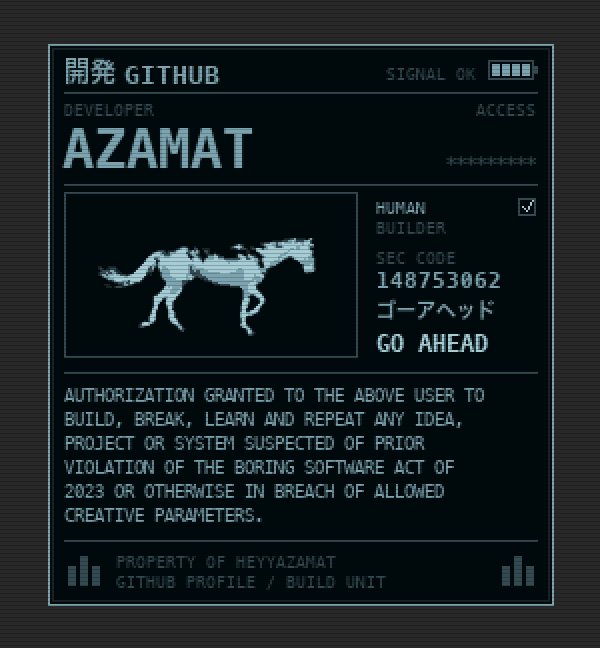

<h1 align="center">
  
</h1>
<h3 align="center">🛠 Builder of ideas • 💻 Code explorer • 🚀 Community shaker</h3>

  

---

## 🌌 About Me
- Coming soon 

> 💡 Motto: *“Build, break, learn, repeat.”*

---

## 🛠 My Toolkit

  
  
  
  
  
  

---

## 🌟 Featured Projects
- Coming soon

> 📝 Each project is a journey. Every line of code tells a story.

---

## 📈 GitHub Insights

  
  

---

## 🎯 What I’m exploring
- Coming soon

---

## 🌐 Let’s Connect

  
  
  

---

  <i>⚡ Code is my playground, learning is my superpower.</i>

