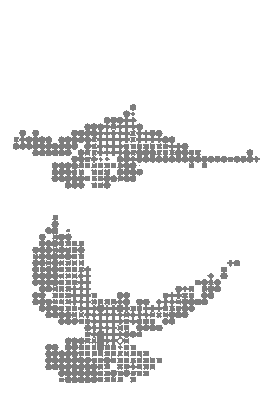
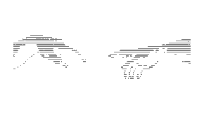

  

  
  &nbsp;&nbsp;
  
  &nbsp;&nbsp;
  
  &nbsp;&nbsp;
  

<h2 align="center">Know About Me</h2>

**Hey there! I'm Azamat.**

I'm 16, from Kazakhstan, and I build technology companies.

Founder of **Creatorfield AI**, selected as a Top-20 startup at nFactorial Incubator 2026. CTO and co-founder of **Ailingo**, an international AI-powered platform for learning 12 languages. I lead **Azyon**, a youth ecosystem of 400+ volunteers across Kazakhstan and several other countries, which has organised more than 50 projects. And I'm building **Human ID** — digital identity protection and verifiable consent for the use of a person's likeness in AI-generated content.

Captain of the **RoboHeart** robotics team: three appearances at the Central Asian FIRST Championship, with awards and nominations among 400+ teams from 10 countries. Top 10 at Decentrathon 4.0 on the Solana track.

I work across AI, full-stack engineering and robotics. What I'm actually chasing is global technology startups at the intersection of AI, software engineering and entrepreneurship.

 

<h2 align="center">Top Projects</h2>

<table>
<tr>
<td width="31%" valign="top">

AI likeness licences, fingerprinted with SHA-256 and anchored on Solana. Biometrics never touch the chain — only hashes.

[**Live demo**](https://human-id-solana.vercel.app)

</td>
<td width="38%" rowspan="2" align="center" valign="middle">

</td>
<td width="31%" valign="top">

AI-driven QA automation, so the humans review instead of transcribe.

</td>
</tr>
<tr>
<td valign="top">

A media-monitoring pipeline — ingest, classify, surface what matters. Containerised end to end.

</td>
<td valign="top">

Side builds and experiments that did not survive contact with a deadline.

</td>
</tr>
</table>

<h2 align="center">Toolkit</h2>

  
  
  
  
  

  
  
  
  
  

  

