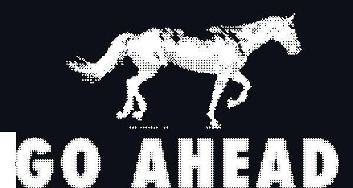
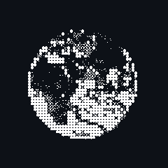

  

  
  
  

  
  
  

<h2 align="center">Know About Me</h2>

**Hey there! I'm Azamat.**

I build systems that prove things are true — licences you can verify, pipelines you can audit, tests that run themselves. Most of it starts at a hackathon and keeps going long after the deadline. I work in TypeScript and Python day to day, and drop into Rust when a chain program needs writing. The interesting part is never only the UI: it's the schema, the API, the on-chain program, and the page it renders on.

Ask me about canonical hashing, on-chain anchoring, or building a whole product in a weekend.

 

<h2 align="center">Top Projects</h2>

<table>
<tr>
<td width="31%" valign="top">

AI likeness licences, fingerprinted with SHA-256 and anchored on Solana. Biometrics never touch the chain — only hashes.

[**Live demo**](https://human-id-solana.vercel.app)

</td>
<td width="38%" rowspan="2" align="center" valign="middle">

</td>
<td width="31%" valign="top">

AI-driven QA automation, so the humans review instead of transcribe.

</td>
</tr>
<tr>
<td valign="top">

A media-monitoring pipeline — ingest, classify, surface what matters. Containerised end to end.

</td>
<td valign="top">

Side builds and experiments that did not survive contact with a deadline.

</td>
</tr>
</table>

<h2 align="center">Toolkit</h2>

  
  
  
  
  

  
  
  
  
  

> Build, break, learn, repeat.

> Anchoring a hash is easy. Deciding what deserves to be permanent is the hard part.

<h2 align="center">Contribution</h2>

  

  

